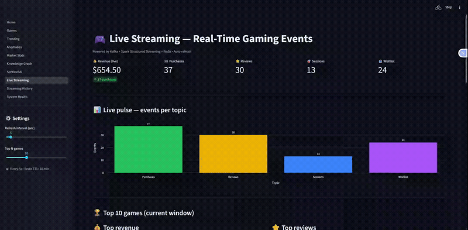

# 🎮 Real-Time Gaming Intelligence Platform

> **Cloud-native data engineering platform** end-to-end: multi-source ingestion, real-time streaming, analytical warehouse, knowledge graph, interactive dashboard, AI agent, Airflow orchestration, and full observability — all deployed on **Azure Kubernetes Service** via **GitHub Actions CI/CD**.

<p align="center">
  
  
  
</p>

<p align="center">
  
  
  
  
  
  
  
  
  
  
  
  
  
  
  
  
  
</p>

<!-- Hero GIF: full dashboard tour (10 pages) -->

---

## 🎥 Live demo



*Live Streaming page: 8 events/sec from the Kafka simulator flow into Spark Structured Streaming, aggregate into Redis, and stream into the dashboard with 5-second auto-refresh. Top games by revenue, reviews, sessions, and wishlist all update live.*

### What's happening under the hood

The GIF above showcases the end-to-end streaming pipeline:

1. **Kafka producers** emit 4 event types (`purchases`, `reviews`, `sessions`, `wishlist`) at ~8 events/sec
2. **Spark Structured Streaming** consumes the topics, runs 8 concurrent queries (4 aggregates + 4 raw events)
3. **Redis** stores 5-minute rolling aggregates (`stat:{topic}:{game_id}` hash keys, 10min TTL)
4. **ADLS Gen2** persists Parquet snapshots of both aggregates (`raw/streaming/`) and raw events (`raw/streaming_events/`)
5. **Airflow micro-batch** (`streaming_copy_to_snowflake` every 5min) loads Parquet into Snowflake `RAW.STREAM_*` and `ANALYTICS.STREAM_*_AGG` tables
6. **FastAPI** exposes `/live/*` (Redis) and `/history/*` (Snowflake) endpoints
7. **Streamlit** renders the live view with Plotly + `st.rerun()` loop (cache-bypassed for true real-time)

### Other features (not shown in GIF)

- **Streaming History** — Snowflake-backed time series with hour/day/week/month/year granularity
- **Sentinel AI** — LangGraph agent (Qwen3:4b via Ollama) that answers questions in natural language by calling the FastAPI endpoints as tools
- **Knowledge Graph** — Neo4j with `SIMILAR_TO`, `PUBLISHED_BY`, `DEVELOPED_BY` relationships, plus 3 anomaly detection queries (viral, review-bomb, ccu-spike)
- **System Health** — unified Streamlit page showing Grafana alerts, Prometheus metrics, and live pod status
- **Grafana** — custom "RTGaming Overview" dashboard with 3 alerting rules (pod down, restart storm, node CPU high)

---

## 🧭 Table of Contents

- [Why this project?](#-why-this-project)
- [Architecture overview](#-architecture-overview)
- [The 16 building blocks](#-the-16-building-blocks)
- [Tech stack](#-tech-stack)
- [What I did NOT use](#-what-i-did-not-use-and-why)
- [Repo structure](#-repo-structure)
- [Feature walkthrough](#-feature-walkthrough)
- [Local reproduction](#-local-reproduction)
- [Technical highlights](#-technical-highlights)
- [Roadmap](#-roadmap)

---

## 💡 Why this project?

The gaming industry generates a massive flow of data: purchases, sessions, reviews, wishlists. The central business question is: **how do we detect games going viral in real time** while keeping **historical analytical visibility**?

This project answers that question by building a **complete cloud-native data engineering platform** that:

- Ingests a **catalog of ~100,000 games** (IGDB + SteamSpy)
- Simulates and processes **8 user events per second** (Kafka + Spark)
- Powers a **Snowflake warehouse** with 20+ dbt models
- Builds a **Neo4j Knowledge Graph** (games, genres, publishers, tags)
- Exposes a **FastAPI service** (20+ endpoints)
- Provides a **10-page Streamlit dashboard** with live + historical views
- Integrates a **local LLM agent** (LangGraph + Ollama Qwen3) for natural-language queries
- Orchestrates everything with **Airflow (3 DAGs)** and **GitHub Actions CI/CD**
- Monitors infrastructure with **Prometheus + Grafana + alerts**

**Portfolio goal**: demonstrate end-to-end mastery of a **production-grade** cloud data platform.

---

## 🏗 Architecture overview


---

## 🧱 The 16 building blocks

| # | Block | Main tech | Deliverable |
|---|---|---|---|
| 1 | **Azure Infrastructure** | Terraform | AKS + ADLS Gen2 + ACR + resource groups |
| 2 | **ADLS data lake** | Azure Storage | `raw/` container with `igdb_games/`, `steamspy_games/`, `streaming/`, `streaming_events/` |
| 3 | **Batch ingestion** | Python + azure-storage-file-datalake | ~10,000 IGDB games + ~86,000 SteamSpy (paginated + resilient) |
| 4 | **Kafka streaming** | Kafka 3.9 KRaft (bitnami Helm chart) | 4 topics: `purchases`, `reviews`, `sessions`, `wishlist` |
| 5 | **Simulator producers** | confluent-kafka + Faker | 4 threaded producers (configurable 8 events/s) |
| 6 | **Spark Structured Streaming** | Spark 3.5 + PySpark | 8 queries: 4 aggregates + 4 raw events → Redis + ADLS |
| 7 | **Snowflake DWH** | Snowflake + snowflake-connector-python | `RAW`, `STAGING`, `ANALYTICS` schemas + ADLS stage |
| 8 | **dbt** | dbt-core + dbt-snowflake | 10 staging + 7 marts (games, genre, publisher, trending, streaming anomalies) |
| 9 | **Neo4j Knowledge Graph** | Neo4j 5 (Helm) + graph-data-science | Nodes: Game/Genre/Publisher/Developer/Platform/Theme/Tag. Relationships: `BELONGS_TO`, `SIMILAR_TO`, `PUBLISHED_BY`, `DEVELOPED_BY` |
| 10 | **FastAPI service** | FastAPI + uvicorn + prometheus-instrumentator | 20+ endpoints: `/games`, `/trending`, `/anomalies`, `/live/*`, `/history/*`, `/health` |
| 11 | **Streamlit dashboard** | Streamlit + Plotly + httpx | 10 pages: Home, Games, Trending, Anomalies, Market Stats, Knowledge Graph, Sentinel AI, **Live Streaming**, **Streaming History**, **System Health** |
| 12 | **Sentinel AI** | LangGraph + langchain-ollama (Qwen3:4b) | Tool-calling agent querying the API in natural language |
| 13 | **Airflow** | Astro Runtime 3.3 (Airflow 3.x) | 3 DAGs: `batch_daily`, `streaming_copy_to_snowflake` (5min), `streaming_agg_copy_to_snowflake` (5min) |
| 14 | **CI/CD** | GitHub Actions | Matrix build → push ACR → apply K8s manifests → rollout restart |
| 15 | **AKS deployment** | Helm + kubectl + manifests | `rtgaming` + `observability` namespaces, 3× B2s_v2 nodes |
| 16 | **Observability** | Prometheus + Grafana + kube-state-metrics | "RTGaming Overview" custom dashboard, 3 alerting rules (pod down / restart / CPU) |

---

## 🛠 Tech stack

### Data & Analytics
- **Ingestion**: Python 3.11 · IGDB API · SteamSpy API · confluent-kafka
- **Streaming**: Apache Kafka 3.9 (KRaft) · Apache Spark 3.5 Structured Streaming
- **Storage**: Azure Data Lake Storage Gen2 (Parquet Snappy)
- **Warehouse**: Snowflake · dbt-core 1.12 · dbt-snowflake
- **Serving**: Redis 8 · Neo4j 5 + APOC + Graph Data Science

### Application
- **Backend**: FastAPI · uvicorn · snowflake-connector-python · neo4j-python-driver
- **Frontend**: Streamlit · Plotly · pandas · httpx
- **AI**: LangGraph · langchain-ollama · Ollama (local Qwen3:4b)

### Orchestration & Ops
- **Orchestration**: Apache Airflow 3.x (Astro Runtime) · KubernetesExecutor-ready
- **CI/CD**: GitHub Actions (matrix build, 6 services)
- **IaC**: Terraform (Azure provider) · Helm 3
- **K8s**: Azure Kubernetes Service (canadacentral) · kubectl · manifests

### Observability
- **Metrics**: Prometheus · kube-state-metrics · node-exporter · prometheus-fastapi-instrumentator
- **Dashboards**: Grafana (built-in + custom "RTGaming Overview")
- **Alerting**: Grafana Alerts (3 rules)

---

## ❌ What I did NOT use (and why)

Deliberate choices to stay focused on the Azure/Snowflake cloud-native stack:

| Tech | Why not |
|---|---|
| **Elasticsearch / Kibana** | Redundant with Grafana for metrics; full-text search adds nothing over Snowflake for this use case |
| **Google Cloud Platform (GCP)** | 100% Azure project for consistency (Azure Students credits) — equivalent architecture is portable via GKE/BigQuery |
| **AWS** | Same — Azure focus |
| **Databricks** | Self-hosted Spark on AKS is enough for project volume (~$500/mo savings vs Databricks) |
| **Snowpipe (event-driven auto-ingest)** | Blocked by student AAD restriction (university admin approval required). Worked around with **Airflow micro-batch every 5 min** — functionally equivalent |
| **Loki** | Native Grafana + Streamlit "System Health" cover the demo needs; Loki would be a future add-on when log volume grows |

---

## 📁 Repo structure

```
realtime-gaming-platform/
├── .github/workflows/         # GitHub Actions CI/CD
│   └── deploy.yml
├── infra/terraform/           # IaC Azure + Snowflake
│   ├── azure/                 # AKS + ACR + ADLS + RG
│   └── snowflake/             # DB + schemas + roles + warehouse
├── ingestion/                 # Python IGDB + SteamSpy
│   └── src/
│       ├── igdb_client.py
│       ├── steamspy_client.py
│       ├── writer.py
│       └── main.py
├── simulator/                 # Kafka producers (4 topics)
│   └── src/producers/
├── streaming/                 # Spark Structured Streaming
│   └── src/
│       ├── main.py
│       ├── kafka_reader.py
│       ├── queries/           # purchases, reviews, sessions, wishlist, raw_events
│       └── sinks/             # redis, adls (agg + raw)
├── snowflake/                 # SQL DDL + COPY scripts + runner
│   ├── ops/
│   ├── sql/ddl/
│   └── sql/copy/
├── gaming_dbt/                # dbt project
│   ├── models/staging/
│   ├── models/marts/
│   └── profiles.yml
├── graph/                     # Neo4j loader + anomalies
│   └── src/
│       ├── loader.py
│       ├── anomalies.py
│       └── main.py
├── api/                       # FastAPI
│   └── src/main.py
├── dashboard/                 # Streamlit (10 pages)
│   ├── Home.py
│   ├── pages/
│   ├── api_client.py
│   └── styles.py
├── sentinel/                  # LangGraph AI agent
│   └── src/
├── airflow/                   # Astro project (3 DAGs + include/)
│   ├── dags/
│   ├── include/               # code + SQL mounted into workers
│   └── Dockerfile
├── observability/             # Grafana dashboards JSON
│   └── grafana/dashboards/
├── k8s/                       # Manifests & Helm values
│   ├── manifests/
│   └── values/
├── scripts/                   # Automation scripts
└── README.md
```

---

## 🎥 Feature walkthrough

### 1. Batch ingestion (Airflow)


The `batch_daily` DAG (schedule 3 AM UTC):

```
ingest_igdb ─┐
             ├─→ snowflake_copy_batch ─→ dbt_deps ─→ dbt_run ─→ refresh_neo4j
ingest_steamspy ─┘
```

Each task is **idempotent**, with configured `execution_timeout` and retries.

### 2. Continuous streaming


```
Simulator (8 events/s) → Kafka → Spark → {Redis, ADLS}
                                            ↓ (Airflow 5min)
                                        Snowflake RAW/ANALYTICS
```

### 3. Streamlit dashboard


10 pages including:

- **Live Streaming**: 5s auto-refresh KPIs + top games per topic + live anomalies (Redis)
- **Streaming History**: Snowflake time series with **hour / day / week / month / year** granularity
- **Sentinel AI**: ask a question to the local LLM (Qwen3 via Ollama), it calls the API and answers in natural language
- **System Health**: real-time Grafana alerts + Prometheus metrics

### 4. Knowledge Graph


Similar-games via cosine similarity + anomaly detection (viral, review-bomb, ccu-spike, wishlist-net).

### 5. Sentinel AI


Example: *"What are the top 3 trending games right now?"* → LangGraph calls `/trending`, formats, answers.

### 6. Grafana observability


Custom "RTGaming Overview" dashboard + 3 configured alerting rules.

### 7. System Health (Streamlit)


Unified view of Grafana alerts + live Prometheus metrics, embedded in the same dashboard.

---

## 🚀 Local reproduction

### Prerequisites

- Docker Desktop
- Azure CLI + subscription (Students tier works)
- kubectl + Helm 3
- Terraform ≥ 1.9
- Python 3.11 + Poetry or venv
- Astro CLI (for local Airflow)
- Snowflake trial (30 days free)

### 1. Provision Azure

```bash
cd infra/terraform/azure
terraform init
terraform apply
```

### 2. Provision Snowflake

```bash
cd infra/terraform/snowflake
terraform init
terraform apply
```

### 3. Build & push images

```bash
git push origin main   # GitHub Actions CI/CD builds 6 images in parallel
```

### 4. Deploy to AKS

```bash
az aks get-credentials --resource-group rtgaming-dev-rg --name rtgaming-dev-aks

# Kafka
helm install kafka bitnami/kafka -n rtgaming --values k8s/values/kafka-values.yaml

# Neo4j
helm install neo4j neo4j/neo4j -n rtgaming --values k8s/values/neo4j-values.yaml

# Redis
helm install redis bitnami/redis -n rtgaming --values k8s/values/redis-values.yaml

# App manifests
kubectl apply -f k8s/manifests/ -n rtgaming

# Observability
helm install prometheus prometheus-community/kube-prometheus-stack \
  -n observability --values k8s/values/prometheus-values.yaml
```

### 5. Start local Airflow

```bash
cd airflow
astro dev start
```

Open `http://localhost:8080` → login `admin`/`admin`.

### 6. Get public URLs

```bash
kubectl get svc -n rtgaming rtgaming-dashboard
kubectl get svc -n observability prometheus-grafana
```

---

## ✨ Technical highlights

What sets this project apart from a tutorial:

- **Micro-batch as Snowpipe fallback** — when the student AAD restriction blocked Snowflake Service Principal creation, I implemented an Airflow DAG (`*/5 * * * *`) that runs the COPY INTO. **Equivalent latency (~5 min)**, identical robustness, universally portable.

- **Idempotent COPY** — the `batch_copy.py` script accepts `--date {{ ds }}` and substitutes the `{DATE}` placeholder in SQL to load only today's partition → **no more duplicates** in dbt marts (bug detected and fixed via `unique_mart_*` tests).

- **Python 3.8 vs 3.14 refactor** — the `apache/spark:3.5.4-python3` image still ships Python 3.8. Streaming code used `str | None` (3.10+ syntax) → refactored to `Optional[str]` for compatibility, learned the hard way.

- **Full-refresh dbt on `mart_games`** — 82,547 duplicates detected in dbt tests → root cause analysis → fixed via date-aware COPY → 0 duplicates on the next test run.

- **Cross-namespace observability** — Streamlit in `rtgaming` queries Prometheus in `observability` via internal DNS (`prometheus-kube-prometheus-prometheus.observability.svc.cluster.local`) without exposing an additional public IP.

- **CI/CD image resilience** — after multiple "wrong image after AKS restart" bugs, permanent fix by editing manifests (`api:latest` vs `rtgaming-api:latest` repos) + `imagePullPolicy: Always` + cleanup of old ACR repos.

- **Streamlit with live state** — the "Live Streaming" page uses `st.rerun()` + `time.sleep(refresh)` in a loop, bypassing the `@st.cache_data` cache of `api_client` to stay **truly real-time**.

---

## 🗺 Roadmap

- [ ] Loki for log aggregation (Streamlit + Airflow)
- [ ] Snowflake ↔ dbt data contracts
- [ ] Feature Store (Feast) for ML
- [ ] Migrate Airflow → AKS (official Helm chart, KubernetesExecutor)
- [ ] Kafka JMX Exporter → Grafana consumer lag dashboard

---

## 📄 Licence

MIT — voir [LICENSE](LICENSE)

