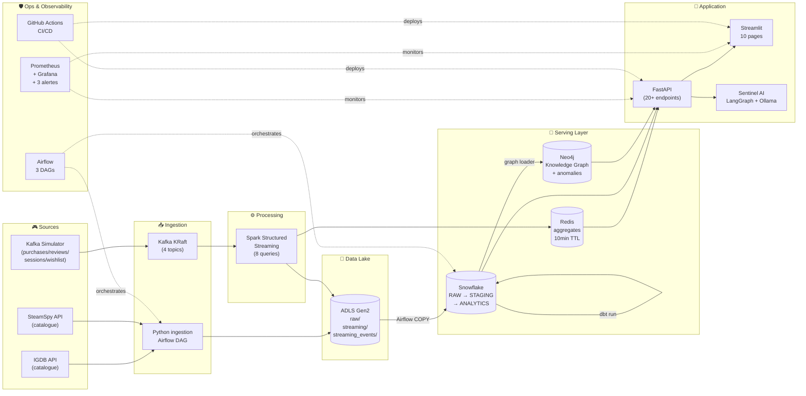

# 🎮 Real-Time Gaming Intelligence Platform

> Plateforme data engineering **cloud-native** de bout en bout : ingestion multi-sources, streaming temps réel, entrepôt analytique, knowledge graph, dashboard interactif, agent IA, orchestration Airflow et observabilité complète — le tout déployé sur **Azure Kubernetes Service** via **CI/CD GitHub Actions**.

<p align="center">
  
  
  
</p>

<p align="center">
  
  
  
  
  
  
  
  
  
  
  
  
  
  
  
  
  
</p>

---

## 🎬 Démo vidéo

> **📹 Loom walkthrough (5 min)** — [Cliquer pour visionner](https://www.loom.com/share/TON_LIEN_LOOM_ICI)

<!-- Ou ajoute ton GIF ici après l'enregistrement -->
<!--  -->

---

## 🌐 Live Demo

Environnement de production tournant sur **AKS Canada Central** :

| Interface | URL | Login |
|---|---|---|
| 🎯 **Dashboard Streamlit** (10 pages) | http://4.172.6.246 | — |
| 📊 **Grafana Observability** | http://20.116.178.122 | `admin` / `rtgaming2026` |

---

## 🧭 Sommaire

- [Pourquoi ce projet ?](#-pourquoi-ce-projet-)
- [Architecture globale](#-architecture-globale)
- [Les 16 briques](#-les-16-briques)
- [Stack technique](#-stack-technique)
- [Ce que je n'ai PAS utilisé](#-ce-que-je-nai-pas-utilisé-et-pourquoi)
- [Structure du repo](#-structure-du-repo)
- [Démo pas à pas](#-démo-pas-à-pas)
- [Reproduction locale](#-reproduction-locale)
- [Highlights techniques](#-highlights-techniques)
- [Roadmap](#-roadmap)
- [Contact](#-contact)

---

## 💡 Pourquoi ce projet ?

Le monde du jeu vidéo génère un flux massif de données : achats, sessions, reviews, wishlist. La question métier centrale est **comment détecter en temps réel les jeux qui deviennent viraux** tout en gardant une **vision analytique historique** ?

Ce projet répond à cette question en construisant une plateforme data engineering **complète et cloud-native** qui :

- Ingère un **catalogue de ~100 000 jeux** (IGDB + SteamSpy)
- Simule et traite **8 événements utilisateurs par seconde** (Kafka + Spark)
- Alimente un **entrepôt Snowflake** avec 20+ modèles dbt
- Construit un **Knowledge Graph Neo4j** (jeux, genres, éditeurs, tags)
- Expose une **API FastAPI** (20+ endpoints)
- Fournit un **dashboard Streamlit** de 10 pages avec vues live + historiques
- Intègre un **agent LLM local** (LangGraph + Ollama Qwen3) pour requêtes en langage naturel
- Orchestre le tout avec **Airflow (3 DAGs)** et **CI/CD GitHub Actions**
- Monitore l'infrastructure avec **Prometheus + Grafana + alertes**

**Objectif portfolio** : démontrer la maîtrise de bout en bout d'une plateforme data cloud **niveau production**.

---

## 🏗 Architecture globale



---

## 🧱 Les 16 briques

| # | Brique | Techno principale | Livrable |
|---|---|---|---|
| 1 | **Infrastructure Azure** | Terraform | AKS + ADLS Gen2 + ACR + resource groups |
| 2 | **Data lake ADLS** | Azure Storage | Containers `raw/` avec `igdb_games/`, `steamspy_games/`, `streaming/`, `streaming_events/` |
| 3 | **Ingestion batch** | Python + azure-storage-file-datalake | ~10 000 jeux IGDB + ~86 000 SteamSpy (paginés + résilients) |
| 4 | **Kafka streaming** | Kafka 3.9 KRaft (Helm bitnami) | 4 topics : `purchases`, `reviews`, `sessions`, `wishlist` |
| 5 | **Producers simulator** | confluent-kafka + Faker | 4 producers threadés (8 events/s configurable) |
| 6 | **Spark Structured Streaming** | Spark 3.5 + PySpark | 8 queries : 4 aggregates + 4 raw events → Redis + ADLS |
| 7 | **Snowflake DWH** | Snowflake + snowflake-connector-python | Schémas `RAW`, `STAGING`, `ANALYTICS` + stage ADLS |
| 8 | **dbt** | dbt-core + dbt-snowflake | 10 modèles staging + 7 marts (games, genre, publisher, trending, anomalies stream) |
| 9 | **Neo4j Knowledge Graph** | Neo4j 5 (Helm) + graph-data-science | Nodes : Game/Genre/Publisher/Developer/Platform/Theme/Tag. Relations : `BELONGS_TO`, `SIMILAR_TO`, `PUBLISHED_BY`, `DEVELOPED_BY` |
| 10 | **API FastAPI** | FastAPI + uvicorn + prometheus-instrumentator | 20+ endpoints : `/games`, `/trending`, `/anomalies`, `/live/*`, `/history/*`, `/health` |
| 11 | **Dashboard Streamlit** | Streamlit + Plotly + httpx | 10 pages : Home, Games, Trending, Anomalies, Market Stats, Knowledge Graph, Sentinel AI, **Live Streaming**, **Streaming History**, **System Health** |
| 12 | **Sentinel AI** | LangGraph + langchain-ollama (Qwen3:4b) | Agent tool-calling qui interroge l'API en langage naturel |
| 13 | **Airflow** | Astro Runtime 3.3 (Airflow 3.x) | 3 DAGs : `batch_daily`, `streaming_copy_to_snowflake` (5min), `streaming_agg_copy_to_snowflake` (5min) |
| 14 | **CI/CD** | GitHub Actions | Build multi-image matrix → push ACR → apply K8s manifests → rollout restart |
| 15 | **Déploiement AKS** | Helm + kubectl + manifests | Namespaces `rtgaming` + `observability`, 3 nodes B2s_v2 |
| 16 | **Observabilité** | Prometheus + Grafana + kube-state-metrics | Dashboard "RTGaming Overview", 3 alertes rules (pod down / restart / CPU) |

---

## 🛠 Stack technique

### Data & Analytics
- **Ingestion** : Python 3.11 · IGDB API · SteamSpy API · confluent-kafka
- **Streaming** : Apache Kafka 3.9 (KRaft) · Apache Spark 3.5 Structured Streaming
- **Storage** : Azure Data Lake Storage Gen2 (Parquet Snappy)
- **Warehouse** : Snowflake · dbt-core 1.12 · dbt-snowflake
- **Serving** : Redis 8 · Neo4j 5 + APOC + Graph Data Science

### Application
- **Backend** : FastAPI · uvicorn · snowflake-connector-python · neo4j-python-driver
- **Frontend** : Streamlit · Plotly · pandas · httpx
- **AI** : LangGraph · langchain-ollama · Ollama (Qwen3:4b local)

### Orchestration & Ops
- **Orchestration** : Apache Airflow 3.x (Astro Runtime) · KubernetesExecutor-ready
- **CI/CD** : GitHub Actions (matrix build, 6 services)
- **IaC** : Terraform (Azure provider) · Helm 3
- **K8s** : Azure Kubernetes Service (canadacentral) · kubectl · manifests

### Observability
- **Metrics** : Prometheus · kube-state-metrics · node-exporter · prometheus-fastapi-instrumentator
- **Dashboards** : Grafana (dashboards préinstallés + custom "RTGaming Overview")
- **Alerting** : Grafana Alerts (3 rules)

---

## ❌ Ce que je n'ai PAS utilisé (et pourquoi)

Choix délibérés pour rester focalisé sur la stack cloud-native Azure/Snowflake :

| Techno | Pourquoi non |
|---|---|
| **Elasticsearch / Kibana** | Redondant avec Grafana pour les métriques ; les recherches full-text n'apportent rien de plus que Snowflake pour cet usage |
| **Google Cloud Platform (GCP)** | Projet 100% Azure pour cohérence (crédits Azure Students) — architecture équivalente portable via GKE/BigQuery |
| **AWS** | Idem — focus Azure |
| **Databricks** | Spark self-hosted sur AKS suffit pour la volumétrie du projet (économie ~500€/mois vs Databricks) |
| **Snowpipe (auto-ingest event-driven)** | Bloqué par restriction AAD étudiante (approbation admin universitaire requise). Contourné par **micro-batch Airflow toutes les 5 min** — équivalent fonctionnel |
| **Loki** | Grafana natif + Streamlit "System Health" suffisent pour la démo ; Loki serait un ajout futur si volume de logs croît |

---

## 📁 Structure du repo

```
realtime-gaming-platform/
├── .github/workflows/         # CI/CD GitHub Actions
│   └── deploy.yml
├── infra/terraform/           # IaC Azure + Snowflake
│   ├── azure/                 # AKS + ACR + ADLS + RG
│   └── snowflake/             # DB + schemas + roles + warehouse
├── ingestion/                 # Python IGDB + SteamSpy
│   └── src/
│       ├── igdb_client.py
│       ├── steamspy_client.py
│       ├── writer.py
│       └── main.py
├── simulator/                 # Kafka producers (4 topics)
│   └── src/producers/
├── streaming/                 # Spark Structured Streaming
│   └── src/
│       ├── main.py
│       ├── kafka_reader.py
│       ├── queries/           # purchases, reviews, sessions, wishlist, raw_events
│       └── sinks/             # redis, adls (agg + raw)
├── snowflake/                 # SQL DDL + COPY scripts + runner
│   ├── ops/
│   ├── sql/ddl/
│   └── sql/copy/
├── gaming_dbt/                # dbt project
│   ├── models/staging/
│   ├── models/marts/
│   └── profiles.yml
├── graph/                     # Neo4j loader + anomalies
│   └── src/
│       ├── loader.py
│       ├── anomalies.py
│       └── main.py
├── api/                       # FastAPI
│   └── src/main.py
├── dashboard/                 # Streamlit (10 pages)
│   ├── Home.py
│   ├── pages/
│   ├── api_client.py
│   └── styles.py
├── sentinel/                  # LangGraph AI agent
│   └── src/
├── airflow/                   # Astro project (3 DAGs + include/)
│   ├── dags/
│   ├── include/               # code + SQL montés dans les workers
│   └── Dockerfile
├── observability/             # Grafana dashboards JSON
│   └── grafana/dashboards/
├── k8s/                       # Manifests & Helm values
│   ├── manifests/
│   └── values/
├── scripts/                   # Automation scripts
└── README.md
```

---

## 🎥 Démo pas à pas

### 1. Ingestion batch (Airflow)

<!--  -->

DAG `batch_daily` (schedule 3h UTC) :

```
ingest_igdb ─┐
             ├─→ snowflake_copy_batch ─→ dbt_deps ─→ dbt_run ─→ refresh_neo4j
ingest_steamspy ─┘
```

Chaque tâche est **idempotente**, avec `execution_timeout` et retry configurés.

### 2. Streaming continu

```
Simulator (8 events/s) → Kafka → Spark → {Redis, ADLS}
                                            ↓ (Airflow 5min)
                                        Snowflake RAW/ANALYTICS
```

### 3. Dashboard Streamlit

<!--  -->

10 pages, avec notamment :

- **Live Streaming** : KPIs auto-refresh 5s + Top games par topic + anomalies live (Redis)
- **Streaming History** : time series Snowflake avec granularité **hour / day / week / month / year**
- **Sentinel AI** : posez une question au LLM local (Qwen3 via Ollama), il appelle l'API et répond en langage naturel
- **System Health** : alertes Grafana + métriques Prometheus temps réel

### 4. Knowledge Graph

<!--  -->

Similar-games via cosine similarity + détections d'anomalies (viral, review-bomb, ccu-spike, wishlist-net).

### 5. Sentinel AI

<!--  -->

Exemple : *« What are the top 3 trending games right now? »* → LangGraph appelle `/trending`, formatte, répond.

### 6. Observabilité Grafana

<!--  -->

Dashboard "RTGaming Overview" + 3 alertes rules configurées.

---

## 🚀 Reproduction locale

### Pré-requis

- Docker Desktop
- Azure CLI + subscription (Students suffit)
- kubectl + Helm 3
- Terraform ≥ 1.9
- Python 3.11 + Poetry ou venv
- Astro CLI (pour Airflow local)
- Snowflake trial (30 jours gratuits)

### 1. Provisionner Azure

```bash
cd infra/terraform/azure
terraform init
terraform apply
```

### 2. Provisionner Snowflake

```bash
cd infra/terraform/snowflake
terraform init
terraform apply
```

### 3. Build & push images

```bash
git push origin main   # CI/CD GitHub Actions build les 6 images en parallèle
```

### 4. Déployer sur AKS

```bash
az aks get-credentials --resource-group rtgaming-dev-rg --name rtgaming-dev-aks

# Kafka
helm install kafka bitnami/kafka -n rtgaming --values k8s/values/kafka-values.yaml

# Neo4j
helm install neo4j neo4j/neo4j -n rtgaming --values k8s/values/neo4j-values.yaml

# Redis
helm install redis bitnami/redis -n rtgaming --values k8s/values/redis-values.yaml

# App manifests
kubectl apply -f k8s/manifests/ -n rtgaming

# Observability
helm install prometheus prometheus-community/kube-prometheus-stack \
  -n observability --values k8s/values/prometheus-values.yaml
```

### 5. Lancer Airflow local

```bash
cd airflow
astro dev start
```

Ouvre `http://localhost:8080` → login `admin`/`admin`.

### 6. Récupérer les URLs publiques

```bash
kubectl get svc -n rtgaming rtgaming-dashboard
kubectl get svc -n observability prometheus-grafana
```

---

## ✨ Highlights techniques

Ce qui distingue ce projet d'un simple tutoriel :

- **Micro-batch en fallback Snowpipe** — quand la restriction AAD étudiante a bloqué la création du Service Principal Snowflake, j'ai contourné en implémentant un DAG Airflow `*/5 * * * *` qui exécute le COPY INTO. **Latence équivalente (~5 min)**, robustesse identique, portable universellement.

- **Idempotence sur les COPY** — le script `batch_copy.py` accepte `--date {{ ds }}` et substitue dans le SQL le placeholder `{DATE}` pour ne charger que la partition du jour → **plus de doublons** dans les marts dbt (bug détecté et corrigé via les tests `unique_mart_*`).

- **Refactor Python 3.8 vs 3.14** — l'image `apache/spark:3.5.4-python3` ship encore Python 3.8. Le code streaming utilisait `str | None` (syntax 3.10+) → refactor en `Optional[str]` pour compatibilité, appris à la dure.

- **Full-refresh dbt sur `mart_games`** — 82 547 duplicates détectés en test dbt → analyse root cause → correction via date-aware COPY → 0 dup au test suivant.

- **Cross-namespace observability** — Streamlit dans `rtgaming` interroge Prometheus dans `observability` via DNS interne (`prometheus-kube-prometheus-prometheus.observability.svc.cluster.local`) sans exposer d'IP publique supplémentaire.

- **CI/CD image resilience** — après plusieurs bugs "wrong image after AKS restart", correction permanente en éditant les manifests (repos `api:latest` vs `rtgaming-api:latest`) + `imagePullPolicy: Always` + suppression des vieux repos ACR.

- **Streamlit avec état live** — la page "Live Streaming" utilise `st.rerun()` + `time.sleep(refresh)` en boucle avec bypass du cache `@st.cache_data` d'`api_client` pour rester **vraiment temps réel**.

---

## 🗺 Roadmap

- [ ] Loki pour agrégation logs (Streamlit + Airflow)
- [ ] Alertes Slack via webhook
- [ ] Data Contracts Snowflake ↔ dbt
- [ ] Feature Store (Feast) pour ML
- [ ] Migration Airflow → AKS (helm chart officiel, KubernetesExecutor)
- [ ] JMX Exporter Kafka → dashboard Grafana consumer lag

---

## 👤 Contact

**Khalifa Seck** — Data Engineer

- 📧 seckhalifaa@gmail.com
- 💼 [LinkedIn](https://linkedin.com/in/khalifaseck)
- 🐙 [GitHub](https://github.com/KhalifaSeck)

---

<p align="center">
  <sub>Built with ❤️ in Sherbrooke, Canada · 2026</sub>
</p>